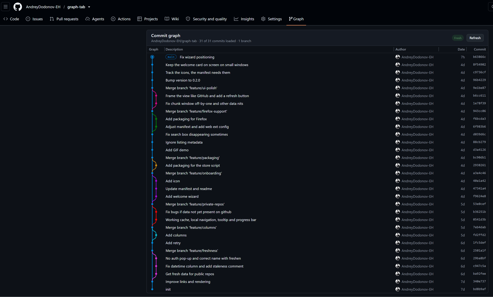

# Graph Tab for GitHub




A standalone Chrome extension that adds a **Graph** tab to GitHub repository
pages and renders the commit graph. It needs **no token, no OAuth, and no
extension permissions**: same-origin fetches from the content script ride the
user's existing github.com session cookie, so any repo you can view in the
browser (public, private, org) works without any setup.


## Install
`WIP, extension store publish pending`
Install from the extension store. Just search for "graph tab".
Works on Chrome and Edge, Firefox is WiP.

## Install for developers (unpacked)

1. `chrome://extensions` → enable *Developer mode*
2. *Load unpacked* → select this directory
3. Open any repository on github.com → click the **Graph** tab

## How it works

- **Data** (`src/data.js`): GitHub's undocumented network-graph endpoints
  (`/{owner}/{repo}/network/meta` + `network/chunk`; the chunk `end` bound is
  inclusive, checked against the live API), fetched newest-window first,
  paginated by the "Load older commits" footer. The endpoints return the entire
  fork network with interleaved commits, so the focused repository is isolated
  by **reachability** from `meta.users[0].heads` (author/owner/block filtering
  gives wrong results, see the findings doc).
- **Freshness** (`src/gitproto.js`, `src/webfresh.js`): the network-graph
  snapshot lags pushes by minutes to hours, so branch heads are re-read live
  and missing commits spliced in. Public repos: git smart-HTTP v2 on
  `/{owner}/{repo}.git` (ls-refs + a `tree:0`-filtered fetch, parsed by an
  own pack reader and RFC-1951 inflater). Private repos reject anonymous git,
  so an opt-in header checkbox ("fetch fresh commits") walks
  `/latest-commit/{ref}` and `/commit/{oid}` (as JSON via `Accept`) instead.
  That costs one request per missing commit, capped and per branch, which is
  why it is off by default.
  Fetched commits are immutable, so they are cached (localStorage, keyed by
  oid) and never re-fetched.
- **Layout** (`src/layout.js`): pure, DOM-free lane assignment following the
  classic `git log --graph` / vscode-git-graph model: lane reservation and
  release, merge edges that join already-open lanes, octopus merges, and
  dashed tails for parents that live below the loaded window.
- **Rendering** (`src/render.js`): one SVG behind fixed-height HTML rows,
  cubic-bezier lane transitions, a stable 12-color palette, and GitHub CSS
  variables for the chrome so light/dark themes both work.
- **Integration** (`src/tab.js`, `src/main.js`): the nav tab is built from
  scratch (not cloned from GitHub markup) and kept alive across soft
  navigations by a debounced MutationObserver + `turbo:load`. The view is
  URL-driven: the tab pushes `#graph` and the view opens/closes purely from
  `location`, so refresh, back/forward, and pasted links all work (a hash,
  unlike a real path, never reaches the server, so nothing can 404).

No build step: `loader.js` dynamic-imports `src/main.js` as an ES module.

## How it was built

Built with Codex (GPT 5.6), which unblocked the three problems that stopped
existing extensions:

- **Authentication**: asking users for a token or OAuth was never an option
  for an extension. Codex, using Playwright and `gh api`, found GitHub's
  undocumented network-graph endpoints, so the extension needs no permissions
  and no token.
- **Stale data**: fresh commits are fetched live over the git smart protocol.
- **Imperfect visuals**: it took a lot of iteration and testing to get the
  graph rendering right.

## Tests

```
node --test tests/*.test.mjs
```

Layout is a pure function, so the graph geometry (lanes, colors, merge joins,
coalesced straight runs, dangling tails) is asserted directly; network code
is tested by stubbing `globalThis.fetch`.


## Deployment

`package.sh` can be used to create a zip for the browser extension store